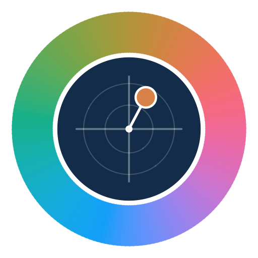

<p align="center"></p>

# Croma

**Visualizador CIELAB / CIELCH** — organize, converta e documente suas amostras de cor com precisão.

Aplicativo [Shiny](https://shiny.posit.co/) para visualizar cores a partir de coordenadas CIELAB (L\*, a\*, b\*) ou CIELCH (L\*, C\*, h°), comparar amostras e gerar um relatório em PDF com um clique.

## Funcionalidades

- **Entrada de dados**: edição linha a linha (CIELAB ou CIELCH, com conversão automática) ou importação colando dados do Excel/planilha (vírgula decimal aceita).
- **Visualização**: paleta de cores, plano cromático a\* × b\*, gráfico L\* × C\* e resumo com a cor média.
- **Agrupamento de repetições**: junta as repetições da mesma amostra (pelo nome, ex.: `Manga A R1`, `Manga A R2`… ou por uma coluna `Grupo`) usando média ou mediana, com desvio padrão e homogeneidade (ΔE₀₀ intra-grupo). Repetições possivelmente atípicas são sinalizadas.
- **Diferença de cor**: ΔL\*, Δa\*, Δb\*, ΔC\*, ΔH\*, ΔE\*ab e ΔE₀₀ (CIEDE2000) em relação a uma amostra ou grupo de referência.
- **Relatório em PDF** (A4 paisagem): resumo, gráficos, paleta, tabela de coordenadas/grupos, ΔE e repetições.

## Como executar

```r
install.packages(c("shiny", "DT", "colorspace", "farver", "png"))
shiny::runApp()
```

## Formato para importação

Valores separados por tabulação, uma amostra por linha:

| Colunas | Exemplo |
|---|---|
| Amostra, L\*, a\*, b\* | `Manga A R1  62,4  18,3  34,7` |
| Grupo, Amostra, L\*, a\*, b\* | `Manga A  R1  62,4  18,3  34,7` |

No modo CIELCH, as duas últimas colunas são C\* e h°.

## Estrutura

- `app.R`: ponto de entrada · `ui.R`: interface · `server.R`: lógica · `global.R`: conversões, gráficos e PDF
- `www/`: estilos e imagens · `scripts/gerar_logo_app.R`: gera a logo do app a partir de cores CIELCH

---

Desenvolvido por **Marlenildo**.
